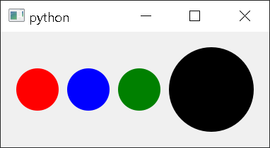

# color-button
circle-shaped color button

## Class and method overview

You can make a new instance of ColorButton like below.

`btn = ColorButton(size=30, color='red')`

`btn = ColorButton(size=40, color='#000000')`

Size argument is value(px) of border-radius, color is value of background-color.

`setColor(rgb)` let you set the color after you made a new instance. rgb is the list of r, g, b. 
Element's type of list can be str or int.

`getColor()` let you get the current color of the box.

There is `colorChanged(QColor)` signal to detect the color of box changed.

## Preview

